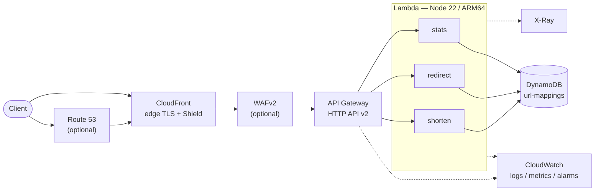
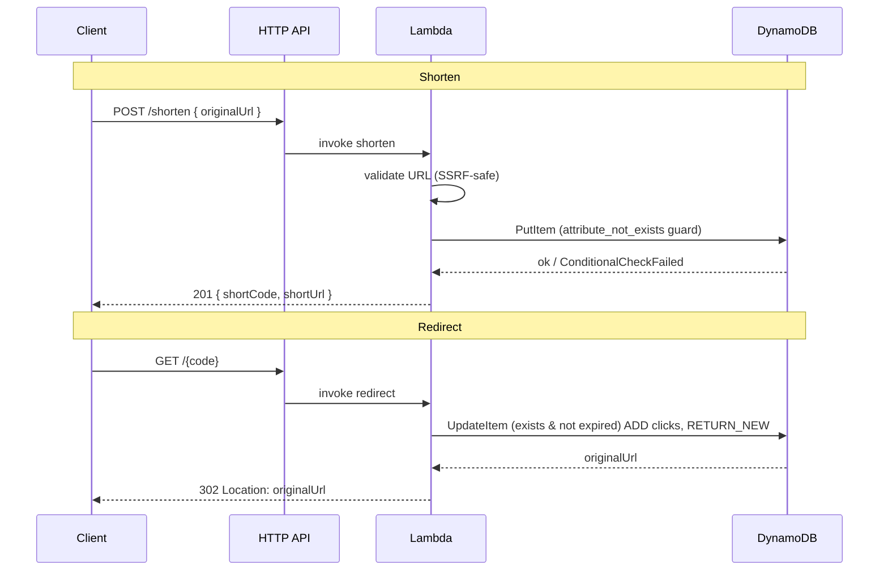

# Architecture

## Service diagram

CloudFront always fronts the API (edge TLS termination, AWS Shield Standard, and
the WAF attachment point). Route 53 / ACM and WAFv2 are opt-in via CDK context.

## Request flows

## Data model (single table)

| Attribute        | Type | Role                                   |
| ---------------- | ---- | -------------------------------------- |
| `shortCode`      | S    | Partition key                          |
| `originalUrl`    | S    | Destination                            |
| `createdAt`      | S    | ISO timestamp                          |
| `ttl`            | N    | Unix epoch; DynamoDB TTL auto-expiry   |
| `clicks`         | N    | Atomic counter                         |
| `lastAccessedAt` | S    | ISO timestamp of last redirect         |
| `userId`         | S    | Optional; GSI `userId-index` partition |

## Key design decisions

- **302, not 301.** Permanent redirects are cached by browsers forever, which
  breaks click counting and makes a link's destination uneditable. The status
  code is configurable (`redirectStatusCode`).
- **Single atomic redirect.** One conditional `UpdateItem` verifies existence
  and TTL, increments `clicks`, and returns the destination — no read-then-write
  race, one round-trip.
- **SSRF-safe validation.** Only `http(s)`; private, loopback, link-local
  (incl. `169.254.169.254`) and internal hosts are rejected.
- **Least privilege.** shorten/redirect get write-only, stats read-only; each
  function has its own log group and role.
- **Opt-in production extras.** Custom domain, WAF, and alarms are off by
  default so the stack runs at ~$0 and is reproducible by anyone.
- **`NodejsFunction` (esbuild).** Handlers are bundled and tree-shaken;
  `@aws-sdk/*` is kept external (already in the runtime).
